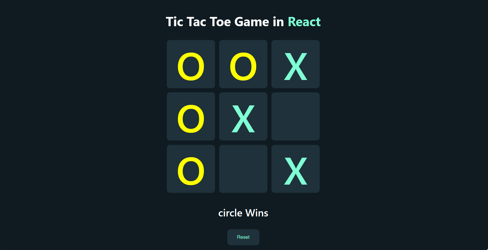

# Tic-Tac-Toe Game

this is a simple game on browser between two players

## Table of contents

- [Overview](#overview)
  - [The challenge](#the-challenge)
  - [Screenshot](#screenshot)
  - [Links](#links)
- [My process](#my-process)
  - [Built with](#built-with)
  - [What I learned](#what-i-learned)
  - [Continued development](#continued-development)
  - [Useful resources](#useful-resources)
- [Author](#author)
- [How to Open](#available-scripts)

## Overview

### The challenge

To accomplish this project I should have - build a react app - style the main elements in a nice layout - define the right logic to the game board to make two players play againest each other and there is only one to win - define the win and draw situations for each player

### Screenshot

### Links

- Live Site URL: [live](https://3omeed.github.io/TicTacToe/)

## My process

### Built with

- Semantic HTML5 markup
- CSS custom properties
- Flexbox
- React.js
- Mobile-first workflow
- JavaScript

### What I learned

First, It was very hard for me to handle the elements clicking and setting X or O according to the game,
then the win situations make a bit challenging for me
this logic has learn me alot

### Continued development

this is my first react project to make with external help off course but i am very proud to make it like this
if you have any troubles testing this out, please let me know

### Useful resources

- [youtube](https://www.youtube.com/watch?v=0PG3XYI3Giw&ab_channel=YehiaTech%D9%8A%D8%AD%D9%8A%D9%89%D8%AA%D9%83)
- [codingbeautydev](https://www.codingbeautydev.com/blog)

## Author

- Website - [Abdelrahman Emad](https://www.linkedin.com/in/abdelrahman-emad-57bb10237/)

## Available Scripts

This project was bootstrapped with [Create React App](https://github.com/facebook/create-react-app).
In the project directory, you can run:

### `npm start`

Runs the app in the development mode.\
Open [http://localhost:3000](http://localhost:3000) to view it in your browser.

The page will reload when you make changes.\
You may also see any lint errors in the console.

### `npm test`

Launches the test runner in the interactive watch mode.\
See the section about [running tests](https://facebook.github.io/create-react-app/docs/running-tests) for more information.

### `npm run build`

Builds the app for production to the `build` folder.\
It correctly bundles React in production mode and optimizes the build for the best performance.

The build is minified and the filenames include the hashes.\
Your app is ready to be deployed!

See the section about [deployment](https://facebook.github.io/create-react-app/docs/deployment) for more information.

### `npm run eject`

**Note: this is a one-way operation. Once you `eject`, you can't go back!**
